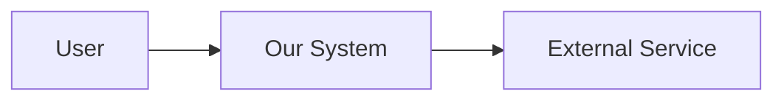
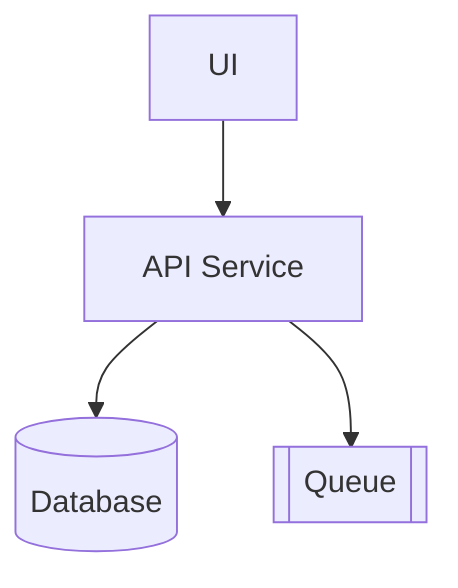

# Architecture Document — {{Feature Name}}

| Field | Value |
|---|---|
| ID | `ARCH-{{feature-slug}}-001` |
| Status | `DRAFT` |
| Version | `0.1.0` |
| Linked PRD | `PRD-{{feature-slug}}-001` |
| Author | {{nama}} |
| Date | {{YYYY-MM-DD}} |

## 1. System Context


Narasi: {{...}}

## 2. Component View


| Component | Responsibility | Owner |
|---|---|---|
| UI | {{...}} | FE |
| API Service | {{...}} | BE |

## 3. Data Flow — {{Skenario Utama}}
1. User melakukan {{...}}.
2. UI mengirim {{...}}.
3. API memvalidasi → menulis ke DB → mempublikasi event.

## 4. Tech Stack
| Layer | Choice | ADR |
|---|---|---|
| Runtime | {{...}} | `ADR-{{feature}}-001` |
| Database | {{...}} | `ADR-{{feature}}-002` |

## 5. NFR Strategy
| NFR | Target | Strategy |
|---|---|---|
| NFR-001 (latency p95 < 300ms) | 300ms | Caching + connection pooling |

## 6. Risks & Mitigations
| Risk | Impact | Mitigation |
|---|---|---|
| {{...}} | High | {{...}} |

---

# Template ADR (1 file per keputusan)

```markdown
# ADR-{{feature-slug}}-001 — {{Judul Keputusan}}

| Field | Value |
|---|---|
| Status | PROPOSED \| ACCEPTED \| DEPRECATED \| SUPERSEDED |
| Date | {{YYYY-MM-DD}} |
| Deciders | {{...}} |

## Context
{{Mengapa keputusan ini perlu diambil. Constraint, force, NFR yang relevan.}}

## Options Considered

### Option A — {{...}}
- Pros: {{...}}
- Cons: {{...}}

### Option B — {{...}}
- Pros: {{...}}
- Cons: {{...}}

### Option C — {{...}}
- Pros: {{...}}
- Cons: {{...}}

## Decision
{{Pilihan yang diambil dan alasan utamanya.}}

## Consequences
- **Positive:** {{...}}
- **Negative:** {{...}}
- **Reversibility:** {{Mudah / Sulit / Tidak}}.

## References
- {{benchmark, paper, dokumen}}
```
