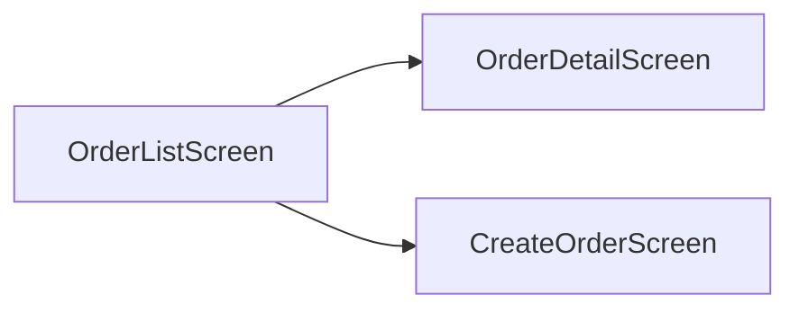

# Data Model — {{Feature Name}}

| Field | Value |
|---|---|
| ID | `DM-{{feature-slug}}-001` |
| Status | `DRAFT` |
| Version | `0.1.0` |
| Linked ARCH | `ARCH-{{feature-slug}}-001` |

## Entities

### `User`
| Attribute | Type | Constraint |
|---|---|---|
| id | UUID v7 | PK |
| email | VARCHAR(255) | UNIQUE, NOT NULL |
| created_at | TIMESTAMPTZ | NOT NULL DEFAULT NOW() |

### `Order`
| Attribute | Type | Constraint |
|---|---|---|
| id | UUID v7 | PK |
| user_id | UUID v7 | FK → User.id, NOT NULL |
| status | VARCHAR(32) | NOT NULL, CHECK in (...) |
| total_amount | NUMERIC(12,2) | NOT NULL |

## Relationships
- `User 1—N Order` via `Order.user_id`.

## Indexes
| Table | Index | Reason |
|---|---|---|
| `Order` | `(user_id, created_at DESC)` | Listing order by user |
| `Order` | `(status)` | Filter status |

## Migrations
1. Create `users` table.
2. Create `orders` table with FK.

---

# OpenAPI Spec — `oas-{{feature-slug}}-001.yaml`

```yaml
openapi: 3.1.0
info:
  title: {{Feature Name}} API
  version: 0.1.0
  description: Linked PRD PRD-{{feature-slug}}-001
servers:
  - url: https://api.example.com/v1
security:
  - bearerAuth: []
paths:
  /orders:
    get:
      summary: List orders for current user
      operationId: listOrders
      responses:
        '200':
          description: OK
          content:
            application/json:
              schema:
                type: array
                items:
                  $ref: '#/components/schemas/Order'
        '401':
          $ref: '#/components/responses/Unauthorized'
components:
  securitySchemes:
    bearerAuth:
      type: http
      scheme: bearer
      bearerFormat: JWT
  responses:
    Unauthorized:
      description: Missing or invalid auth token
  schemas:
    Order:
      type: object
      required: [id, userId, status, totalAmount]
      properties:
        id: { type: string, format: uuid }
        userId: { type: string, format: uuid }
        status: { type: string, enum: [pending, paid, shipped, cancelled] }
        totalAmount: { type: number, format: decimal }
```

---

# UI Spec — {{Feature Name}}

| Field | Value |
|---|---|
| ID | `UIS-{{feature-slug}}-001` |
| Status | `DRAFT` |

## Screens

### Screen S1 — `OrderListScreen`
- **Purpose:** Menampilkan daftar order milik user.
- **Linked US:** `US-{{feature-slug}}-001`.
- **Data Source:** `GET /orders`.

**Components**
- Header (title, refresh button).
- Filter chips (status).
- List item (order number, status badge, total, date).

**States**
| State | Trigger | UI |
|---|---|---|
| Loading | initial fetch | Skeleton 5 baris |
| Empty | response 200 + array kosong | Illustrasi + CTA "Buat Order" |
| Error | network/5xx | Alert + tombol Retry |
| Success | response 200 + data | Render list |

**Copy**
- Empty: "Belum ada order. Yuk buat yang pertama."
- Error: "Gagal memuat. Coba lagi ya."

## Navigation

