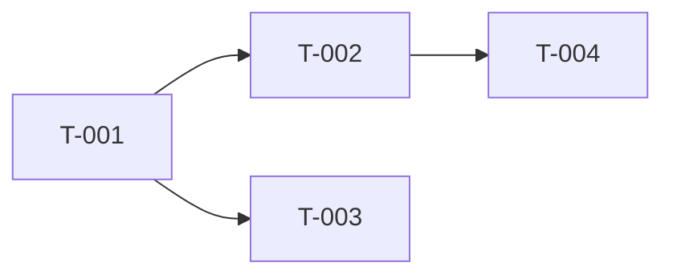

# Task Breakdown — {{Feature Name}}

| Field | Value |
|---|---|
| ID | `TB-{{feature-slug}}-001` |
| Status | `DRAFT` |
| Linked PRD | `PRD-{{feature-slug}}-001` |

## Milestones
| Milestone | Tasks | Goal |
|---|---|---|
| M1 | T-001..T-005 | Backend ready |
| M2 | T-006..T-010 | Frontend integrated |
| M3 | T-011..T-013 | Hardening & launch |

## Tasks

### T-{{feature-slug}}-001 — {{Judul singkat aksi}}
- **Layer:** BE
- **Estimate:** M
- **Linked:** `US-{{feature}}-001`, `OAS:/orders [GET]`
- **Depends on:** —
- **Description:** {{apa yang dikerjakan secara high-level}}
- **Acceptance Criteria:**
  - [ ] {{kriteria 1, dapat diuji}}
  - [ ] {{kriteria 2}}

### T-{{feature-slug}}-002 — {{...}}
- **Layer:** FE
- **Estimate:** M
- **Linked:** `US-{{feature}}-001`, `UIS:S1`
- **Depends on:** `T-{{feature-slug}}-001`
- **Description:** {{...}}
- **Acceptance Criteria:**
  - [ ] {{...}}

## Dependency Graph

