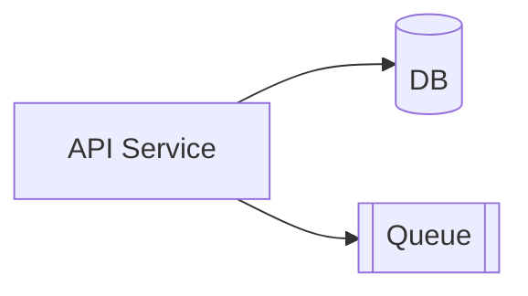

# Release Notes — {{Feature Name}} v{{X.Y.Z}}

| Field | Value |
|---|---|
| ID | `RN-{{feature-slug}}-001` |
| Version | `vX.Y.Z` |
| Date | {{YYYY-MM-DD}} |
| Linked TR | `TR-{{feature-slug}}-001` |

## What's New
- {{fitur baru, kalimat user-friendly}}.

## Improvements
- {{...}}

## Bug Fixes
- Memperbaiki masalah {{...}} (BUG-007).

## Known Issues
- {{deskripsi}} — workaround: {{...}}.

## Migration Guide
{{Hanya jika ada breaking change. Sertakan langkah migrasi data/konfigurasi.}}

---

# Runbook — {{Feature Name}}

| Field | Value |
|---|---|
| ID | `RB-{{feature-slug}}-001` |
| Linked ARCH | `ARCH-{{feature-slug}}-001` |
| Owner | {{tim/oncall}} |

## 1. Service Map

## 2. Health Checks & Dashboards
| Check | URL | Expected |
|---|---|---|
| Liveness | `/healthz` | 200 |
| Readiness | `/readyz` | 200 |
| Dashboard | {{link}} | — |

## 3. Common Alerts
| Alert | Threshold | Action |
|---|---|---|
| API 5xx > 1% / 5min | high | Cek log, cek dependency, jika berlanjut → rollback |
| Latency p95 > 500ms / 10min | medium | Scale up, cek DB slow query |

## 4. Rollback Procedure
1. Toggle feature flag `{{flag_name}}` ke `off`.
2. Jika masalah berlanjut, redeploy versi sebelumnya: `kubectl rollout undo ...`.
3. Verifikasi `/healthz`.
4. Komunikasi status ke channel `#incidents`.

## 5. Feature Flag
| Flag | Default | Owner |
|---|---|---|
| `{{flag_name}}` | `off` | {{tim}} |

## 6. Contacts
| Role | Name | Channel |
|---|---|---|
| Primary on-call | {{...}} | Slack `@user` |
| Secondary | {{...}} | Slack `@user` |
| Escalation | {{...}} | PagerDuty |
