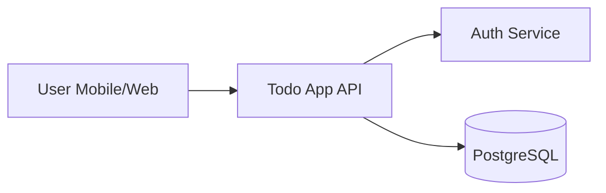
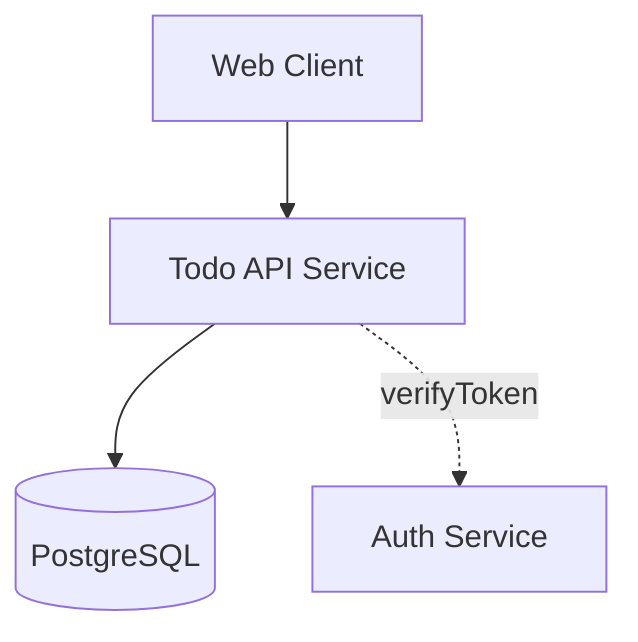

# Architecture Document — Personal Todo App

| Field | Value |
|---|---|
| ID | `ARCH-todo-001` |
| Status | `APPROVED` |
| Linked PRD | `PRD-todo-001` |

## 1. System Context

User menggunakan client (web/mobile), berkomunikasi via HTTPS ke Todo App API. API memvalidasi token via Auth Service dan menyimpan data di PostgreSQL.

## 2. Component View

| Component | Responsibility |
|---|---|
| Web Client | Render UI, panggil API |
| Todo API | CRUD todo, otorisasi |
| PostgreSQL | Persistensi |
| Auth Service | JWT verification (existing) |

## 3. Data Flow — Add Todo
1. User mengetik judul → klik "Add".
2. Client `POST /todos` dengan bearer token.
3. API verifikasi token → validasi input → insert DB.
4. API return 201.

## 4. Tech Stack
| Layer | Choice | ADR |
|---|---|---|
| API runtime | Node.js + Fastify | `ADR-todo-001` |
| Database | PostgreSQL 16 | `ADR-todo-001` |
| Auth | Existing JWT service | — |

## 5. NFR Strategy
| NFR | Strategy |
|---|---|
| NFR-001 (p95 < 200ms) | Connection pooling, single-table query, index on user_id. |
| NFR-002 (≥ 99.5%) | Managed Postgres, single-region, basic health check. |
| NFR-003 (Bearer JWT) | Verifikasi token via Auth Service di tiap request. |
| NFR-004 (data isolated) | Semua query difilter `WHERE user_id = ?`. |

## 6. Risks & Mitigations
| Risk | Mitigation |
|---|---|
| Auth Service downtime | Cache public key JWT, fail-closed dengan retry exponential. |

---

# ADR-todo-001 — Pilih Node.js + Fastify + PostgreSQL untuk MVP

| Field | Value |
|---|---|
| Status | ACCEPTED |
| Date | 2026-05-23 |

## Context
Tim familiar dengan TypeScript. NFR latency p95 < 200ms. Skala MVP rendah (≤ 1000 user). Butuh stack yang murah dan cepat di-iterasi.

## Options Considered

### Option A — Node.js + Fastify + PostgreSQL
- Pros: Tim familiar, ekosistem matang, perf cukup, managed Postgres murah.
- Cons: Ekosistem typing antar lib tidak konsisten.

### Option B — Go + chi + PostgreSQL
- Pros: Latency rendah, single binary.
- Cons: Tim belum familiar, waktu ramp-up tinggi.

### Option C — Firebase (NoSQL)
- Pros: Cepat di-setup, autentikasi built-in.
- Cons: Vendor lock-in, query relasional terbatas, biaya skala tidak prediktif.

## Decision
Pilih **Option A** karena memenuhi NFR latency, tim produktif sejak hari pertama, dan biaya operasional rendah.

## Consequences
- Positive: Time-to-market cepat.
- Negative: Saat skala besar mungkin perlu migrasi (reversibility: medium).
