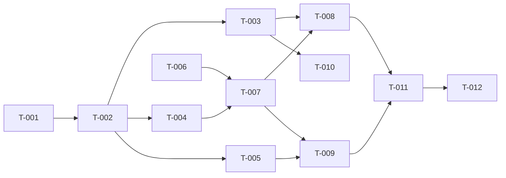

# Task Breakdown — Personal Todo App

| Field | Value |
|---|---|
| ID | `TB-todo-001` |
| Linked PRD | `PRD-todo-001` |

## Milestones
| Milestone | Tasks | Goal |
|---|---|---|
| M1 — BE Ready | T-001..T-005 | API endpoint hidup di staging |
| M2 — FE Integrated | T-006..T-009 | Web client bisa CRUD todo |
| M3 — QA & Launch | T-010..T-012 | Test pass, dirilis |

## Tasks

### T-todo-001 — Setup project skeleton (Fastify + TS)
- Layer: BE | Estimate: M | Linked: ADR-todo-001
- AC:
  - [ ] `pnpm dev` jalan di port 3000.
  - [ ] `/healthz` return 200.

### T-todo-002 — Migration: create `todos` table
- Layer: DB | Estimate: S | Linked: DM-todo-001
- Depends: T-todo-001
- AC:
  - [ ] Migration script idempotent.
  - [ ] Index `(user_id, created_at DESC)` ada.

### T-todo-003 — Implement POST /todos
- Layer: BE | Estimate: M | Linked: US-todo-001, OAS:/todos POST
- Depends: T-todo-002
- AC:
  - [ ] Title 1–140 char divalidasi.
  - [ ] Token diverifikasi.
  - [ ] Insert DB, return 201 dengan body sesuai schema.

### T-todo-004 — Implement GET /todos
- Layer: BE | Estimate: S | Linked: US-todo-003, OAS:/todos GET
- Depends: T-todo-002
- AC:
  - [ ] Filter `user_id = currentUser`.
  - [ ] Urut `created_at DESC`.

### T-todo-005 — Implement PATCH /todos/{id} & DELETE /todos/{id}
- Layer: BE | Estimate: M | Linked: US-todo-002, OAS
- Depends: T-todo-002
- AC:
  - [ ] Otorisasi: 404 jika bukan milik user.
  - [ ] PATCH return updated todo, DELETE return 204.

### T-todo-006 — FE skeleton + auth wiring
- Layer: FE | Estimate: M | Linked: UIS:S1
- AC: app bisa login dan menyimpan token.

### T-todo-007 — TodoListScreen — render list & empty state
- Layer: FE | Estimate: M | Linked: US-todo-003, UIS:S1
- Depends: T-todo-006, T-todo-004
- AC:
  - [ ] Loading skeleton.
  - [ ] Empty state.
  - [ ] Error retry.

### T-todo-008 — TodoListScreen — add todo
- Layer: FE | Estimate: M | Linked: US-todo-001
- Depends: T-todo-007, T-todo-003
- AC:
  - [ ] Input + Add button + validasi inline.

### T-todo-009 — TodoListScreen — toggle done & delete
- Layer: FE | Estimate: M | Linked: US-todo-002
- Depends: T-todo-007, T-todo-005
- AC:
  - [ ] Optimistic update + rollback saat error.

### T-todo-010 — Contract test vs OAS
- Layer: QA | Estimate: M | Linked: OAS-todo-001
- AC: spectral lint pass; schemathesis suite green.

### T-todo-011 — E2E happy paths
- Layer: QA | Estimate: M | Linked: US-todo-001..003
- AC: Playwright suite covering 3 user stories.

### T-todo-012 — Load test NFR-001
- Layer: QA | Estimate: S | Linked: NFR-001
- AC: k6 100 vu × 1 min, p95 < 200ms.

## Dependency Graph

